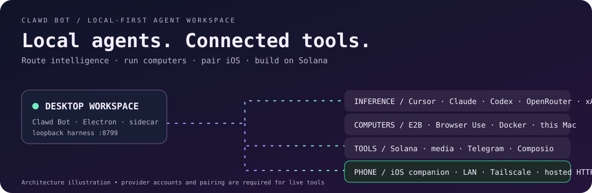
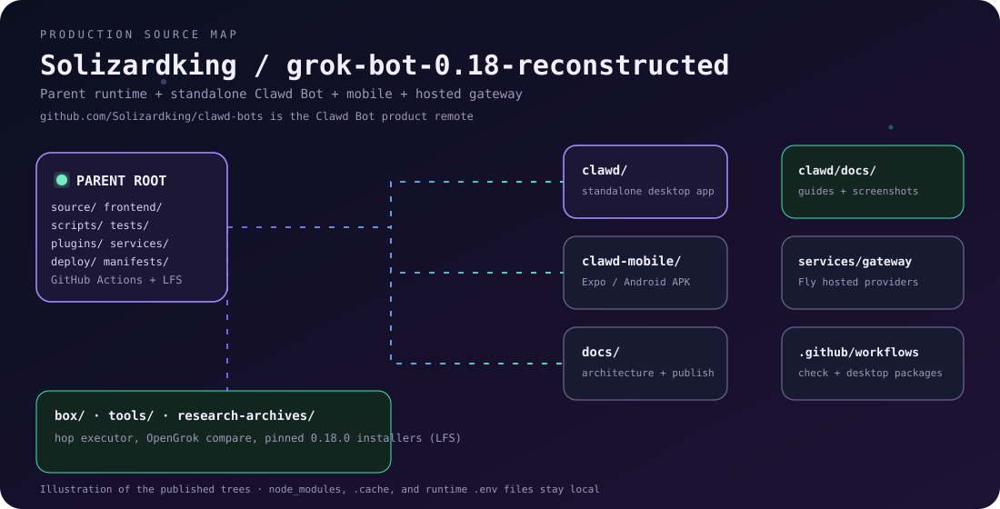

# Clawd Bot architecture

Clawd Bot is a local-first workspace for AI agents, computer tools, and Solana
integrations. The standalone application lives in [`clawd/`](../clawd/README.md).
Its React UI, agent server, Electron shell, companion, and updater build from
that directory without the parent reconstruction.

## Application and service boundaries

- `clawd/` contains the standalone Clawd Bot application and its imported service snapshot.
- `source/` and `frontend/` contain the parent desktop runtime and partial React
  reconstruction. They have separate build and packaging commands.
- `services/provider-gateway/` holds the shared hosted-provider gateway. Clients
  use revocable account tokens; operator provider keys stay on the server.
- `box/` and `tools/` contain the optional hop executor, provider maps, and file relay.
  Installing those files does not install a host binding consumer.

## Parent runtime build

The parent build uses the checksum-pinned upstream Grok Bot 0.18.0 application
as an external input. `npm run bootstrap` extracts it to ignored `src/app/dist`.
Build scripts stage that baseline, compile reviewed source runtimes, overlay
eligible outputs, apply the updater guard, and pack a new ASAR. The default
macOS package retains the pinned renderer with Router, Solana, and read-aloud
patches; `frontend/` remains a partial reconstruction.

`npm run smoke` checks that packaged composition before an isolated launch
with mock keychain state. This is separate from Clawd Bot's standalone build
and does not prove authenticated provider or tool execution.

## Hosted tools

E2B supplies isolated desktops; Browser Use supplies a separate browser fleet.
Solana agent mint/register/delegate and DAS use `HELIUS_RPC_URL`, derived from
`HELIUS_API_KEY` when unset. `CLAWD_GATEWAY_URL` configures the optional Clawd
Gateway integration. Provider availability and account grants must be checked
for the specific route in use.

Two parent Telegram targets exist: `npm run build:bridge` stages the full bridge
in `.build/telegram-bridge`; `npm run build:service` builds the lightweight
service in `services/telegram-fly/dist`. Their tool and configuration surfaces differ.

See [hosted infrastructure](clawd-infrastructure.md), [Fly hosting](FLY-HOSTING.md),
and the [OpenGrok reference comparison](OPENGROK-COMPARISON.md). Legacy paths,
protocol fields, and upstream attribution remain intact for compatibility.
