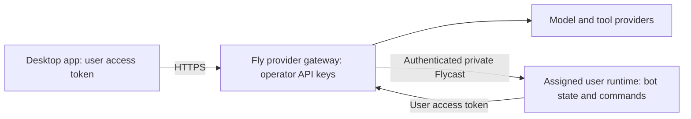

# Clawd Bot Fly hosting and provider secrets

This guide covers Clawd Bot and its shared provider infrastructure. Commands
run from the parent repository root unless stated otherwise. Existing Fly app
names (`grok-provider-gateway-8bit`, `grok-runtime-owner-8bit`), `SAND_*` fields,
and provider model IDs are operational identifiers, not product branding.
Dated validation entries below are recorded evidence, not a fresh health check.

Deployed gateway: `https://grok-provider-gateway-8bit.fly.dev` (one Machine in
`iad`). On 2026-09-07 the health check, unauthorized-request rejection, and a
real authenticated OpenRouter streaming completion passed. OpenRouter, xAI,
Helius, Browser Use, E2B, and Birdeye are configured. Birdeye currently returns upstream 403 Access Denied; its key needs account-side verification. The owner policy allows `grok-4.6`;
the xAI gateway stream, unauthorized rejection, durable usage, and actual
desktop xAI inference module all passed live verification.
The actual desktop `provider-session` module was also verified live: it streamed
the expected reply through Fly with only the user token, using isolated local
state. A later signed-in desktop conversation also returned `READY` through Fly.
Persistent accounting was also verified live: one streamed completion
reserved one daily request, and `/v1/account` still reported one request after
a successful Fly Machine restart. The gateway uses an encrypted 1 GB volume
with scheduled snapshots.
The initial owner credentials are in the ignored, mode-600 local file
`.cache/gateway-owner/client.env`; issue a separate token for each additional
user. Use `npm run gateway:deploy` for this service. The legacy root `deploy`
script targets Cloudflare and does not deploy the Fly gateway.

Local validation passed: 225 root tests in the latest macOS packaging run;
subsequent hosted research and Birdeye changes passed 247 root tests and both typechecks on 2026-09-08. Clawd Bot's three typechecks, UI/server builds, and six focused chat/research tests also passed.
Earlier subsystem validation includes
42 control-plane tests, 7 Composio
broker tests, source and
frontend typechecks, Clawd typechecks, both UI builds, both Telegram bundles,
and macOS packaging/signature verification. The isolated native launch smoke
also passed (renderer started, no fatal startup logs). Individual external tool integrations still require their own live checks.
The latest packaged app was also opened through native UI automation. Its
onboarding completed through the first-bot screen, and Settings → Router
displayed the hosted-provider form with the correct Fly URL and model.
The owner approved importing the existing token and testing a conversation.
Native file import and save succeeded after fixing a reserved-name validation
bug. The validator permits only the two hosted access fields within the
otherwise reserved `SAND_` namespace. The app displayed **Hosted credentials
saved**, selected `openrouter/free`, and cleared the password field. The encrypted
user-secrets file contains both hosted field names; no secret values were exposed.
After the private runtime and coordinator connector were fixed, the
`Hosted setup check` bot was created and a normal desktop conversation visibly
returned `READY` using the saved owner token. Runtime verification covers discovery, authenticated health/listing, test-bot creation/retention,
and unauthorized rejection all passed on 2026-09-08 UTC. It runs in
`grok-runtime-owner-8bit` (Machine `48e67eeb52ed58`, `iad`, 1 GB RAM, encrypted
1 GB data volume), on its own private network. Its only allocated address is
private Flycast ingress from the gateway's network. A new desktop connector
uses the saved user token to reach this assigned runtime. Both the recovery
connector and the production conversation coordinator are wired to hosted
access; an integration regression verifies the latter never consults Cursor
when hosted access is configured. Inference credentials
are passed through a scoped coordinator context without mutating shared process
environment. The successful normal desktop turn executes the tool loop locally;
its inference-router transcript remains in the desktop data directory.
A separate native host test (`Hosted runtime check`) retained both the prompt
and `READY` reply on Fly, verified through `/api/getAgentTranscript`.
Full remote OpenRouter/xAI turns are experimental and require
`SAND_HOSTED_REMOTE_TURNS=1` in the desktop coordinator environment. They are
not enabled by default: the native host toolset does not yet include all desktop
wallet and custom integrations. In that mode new history lives on Fly;
older local history is displayed with distinct IDs but is not migrated into
cloud model context. Model synchronization and the default model configuration are deployed to the
native runtime. The native MCP bridge now exposes the owner's 24 granted tools
through the normal tool infrastructure; direct discovery and service-status
execution passed live checks. Agent conversations exposed missing installed-server
listing, wrapped provider schemas, and absent per-turn MCP execution resources.
The listing, schema, execution-resource and discovery/call tool fixes are deployed.
The next native conversation discovered the tool and attempted invocation, but
auto-review rejected execution with a classification error. Classification failures now enter the existing manual-review flow; the next native service-status request remains pending there. Native conversation tool completion is therefore not yet verified; the direct API smoke remains passing.
Do not treat the response marker alone as proof of tool use.
The existing local-account fallback can display
`Signed in to Cursor` without an actual Cursor session; that label is not evidence
of remote-computer access.
Node 26.5.0 was downloaded from
nodejs.org, checked against its published SHA-256, and installed at
`.cache/node-v26.5.0-darwin-arm64/bin/node`. The global Node selection remains
unchanged; prepend that directory to PATH in your development terminal.

The desktop application and its macOS/Electron runtime stay on the user's
computer. The new `services/provider-gateway` is a separate Linux service that
holds operator-owned OpenRouter/xAI/Helius/Browser Use/E2B/Birdeye API keys and handles
chat completions, Solana data reads, and isolated cloud browser/desktop resources.
The user receives a revocable gateway token, never an operator provider key.
Streaming and desktop tool-call responses pass through the gateway; tools
continue to execute on the desktop/box. This is not yet a hosted website or a
gateway for every tool provider yet.

## What belongs where

### Chat research, Composio, and Pump MCP

The installed Clawd Bot chat includes **Search & markets**. Web searches save up to
five Tavily sources into the conversation. Crypto search resolves the exact
network and contract, then saves real 24h, 7d, or 30d OHLCV candles with an
interactive candle inspector. Pool prices, liquidity, volume, market cap/FDV,
source URLs, and retrieval times remain attached to each snapshot. Financial
context replays recent saved evidence and distinguishes pool coverage, wrapped
assets, stale search snippets, and missing values. No missing candles are invented.

The automatic `market_snapshot` conversation check passed in the installed app
on 2026-09-08 at 07:48 UTC: one successful tool call, a persisted 24-candle chart,
and a final answer using the returned price, time, and source. `wrapped-sol` is
accepted as an unambiguous Solana mint alias. The manual search, chart inspector,
and analysis of a saved snapshot also passed live UI checks.

Gateway `market` access enables `/market/request` and `/market/mcp`; search uses
DEX Screener and historical pool data uses GeckoTerminal. A separate `birdeye`
grant adds Solana token fundamentals using the existing Fly `BIRDEYE_API_KEY`.
`/birdeye/request` accepts `{action:"market_data",mints:[...]}` with at most 20
addresses, deduplicated and requested in raw UI amount mode. Search batches the
Solana candidates, while snapshots enrich the selected token. The UI keeps
Birdeye price, token-wide liquidity, holders, circulating/total supply, market
cap, FDV, and Token-2022 scaling metadata separate from pool figures. Each
provider retains its own timestamp. Missing metrics stay unavailable; HTTP
401/403 backs off for five minutes and renders an explicit access status while
the public chart remains usable. The supplied endpoint documentation lists
Business/Enterprise access; no account plan is changed automatically.

The owner also has `composio`, `pump`, and `sandbox` grants. Composio uses a
server-bound private user/account/auth-config mapping. Eight SOLgpt research
tools execute with toolkit `custom_solgpt` pinned to version `20260824_02`.
The existing connected account `ca_Omr3yvw7x5TI` is active, but its underlying
`https://solgpt.us/api/mcp` credential still returns HTTP 401. A healthy Composio
session or discovery result does not mean that upstream credential is fixed.

Pump research instead uses the separately authenticated
`https://solgpt-pumpfun-mcp.fly.dev/mcp`. Its Fly-only operator token exposes 12
read-only research/documentation tools through the gateway. Discovery and
`get-program-ids` passed live. The alternate `solgpt-pump-mcp-original` service
is not the selected endpoint. Signing and transaction tools are not exposed by
this research proxy.

Composio remote workbench and Bash require the separate `sandbox` grant and use
the owner's persisted session. Callers cannot supply another session or account
ID. A live Python workbench call returned `CLAWD_SANDBOX_READY 6`. Sandbox errors
remain errors even when nested inside an HTTP-success response. This research
session integration does not enable shared connections for all users; additional
users require their own explicitly provisioned gateway grants and bindings.

Owner engines enable `hostedComposio`, `hostedMarket`,
`hostedPump`, `hostedSandbox`, and `financeResearch` in their compatible
configuration. Novita retains finance context and chat access but automatic tool
calling remains disabled because the dedicated endpoint rejected auto tool
selection without its server-side parser configuration. The desktop stores only
its revocable gateway token; operator provider keys remain on Fly.

### Installed Clawd Bot

`/Applications/Clawd Bot.app` now connects through the same gateway with its
owner access token. Its OpenAI-compatible engine lists `openrouter/free` and
`nvidia/nemotron-3.5-lightning:free`; a separate `Fly novita` engine lists
`solanaclawd/solana-nvidia-trading-factory-8b:de-b5d83f18d9145215`.
On 2026-09-08 UTC, real conversations in that installed app visibly returned
`CLAWD_FLY_READY` from Nemotron and `NOVITA_FLY_READY` from Novita.
The main Clawd Bot agent currently uses `openrouter/free`. Both provider keys remain on Fly.
The model-picker's local-only classification of compatible engines was fixed,
tested (3 engine-rail tests and the Clawd frontend typecheck), built and installed;
the app's existing ad-hoc signature was renewed and verified. A UI backup is in
the ignored `.cache/clawd-installed-ui-backup` directory.

The gateway serves authenticated, per-user `/openrouter/v1/models`,
`/xai/v1/models`, and `/novita/v1/models` catalogs. `chatModels` in each user's
policy explicitly selects already-granted models for each catalog. Use
`set-chat-models.mjs` to add catalog entries, with `--grant` only when authorizing
a new model. Novita chat uses a fixed dedicated API URL. Reasoning options are
validated and bounded by the overall token cap; message `reasoning_details`
and upstream streaming responses pass through unchanged. The installed Clawd Bot
driver does not yet retain structured reasoning details across later turns.
Tavily's key is stored as `TAVILY_API_KEY` on Fly. The authenticated
`/tavily/mcp` endpoint exposes bounded `tavily_search` and `tavily_extract`
tools. The installed Clawd Bot compatible driver discovers these tools, executes
model tool calls, and preserves structured reasoning between tool steps.
Discovery does not consume the daily provider allowance; actual tool calls do.
Tool activity uses the model call ID to record success or failure. The first
live search recorded a successful tool execution, but the app restarted before
the final model answer. After the branding update, a second live search completed
with a successful activity status; its follow-up Nemotron model response timed
out. A separate lower-effort Nemotron request also timed out before returning
tokens. These results verify Tavily execution, not reliable model availability.

The 2026-09-08 branding update changes all MAUS display copy, avatar identifiers,
and CSS names to Clawd, including the routine and webhook forms. New local
routine and webhook destinations use `clawd`; existing `maus` values are accepted
at compatibility boundaries. Original license attribution and legacy import
formats remain intact. The source, publication snapshot, release app, and
installed `/Applications/Clawd Bot.app` were updated; the app signature verifies.
Both requested labels were verified through the installed app's accessibility UI.
Clawd typechecks and 46 focused tests passed, including migration and unattended
routine tests. Companion source was updated; its tests require XCTest, which is
not present in this machine's Command Line Tools installation.



Each additional user needs a distinct gateway token and a separately assigned
runtime app, private network, and volume. The runtime receives that user's
gateway access, while provider API keys remain on the gateway.

| Component | Hosting |
| --- | --- |
| OpenRouter/xAI chat keys | Fly runtime secrets on the provider gateway |
| Birdeye market data | Fly gateway, granted per user; configured key currently returns upstream 403 |
| Helius RPC/DAS reads | Fly gateway, granted per user |
| Telegram bot token, speech keys | Existing dedicated Telegram Fly app |
| Wallet signing keys, PayBox signing grants, personal Codex/Claude sessions | Remain scoped to their owner; do not distribute a shared operator signer |
| Browser Use key | Fly gateway; browser/run/session ownership persisted per user |
| E2B desktop key | Fly gateway, one isolated desktop reservation per user |
| Reconstructed host, bot state, box commands | Separate private Fly runtime and encrypted volume for each user; see [runtime deployment](../services/desktop-runtime/README.md) |
| Kernel/Phantom tool credentials | Existing local configuration until authenticated, user-owned resource brokers are implemented |
| `.build`, `.cache`, `dist`, `src/app/dist`, `node_modules` | Generated inputs/output; never upload the whole working tree as a secret store |
| Clawd harness | Local development only: no public user auth, shared state, plaintext wallet storage |

Fly stores secrets encrypted and injects them into the process at runtime.
People able to deploy code or access the Machine can read runtime secrets.
See [Fly secret documentation](https://fly.io/docs/apps/secrets/).
The gateway Docker context is allowlisted to gateway runtime files and `Dockerfile`;
it never copies desktop files, env files, wallet stores, or cached sessions.
The image also includes the account store and privilege-dropping entrypoint.
The listener runs as `node`; a root entrypoint only prepares `/data/gateway`
permissions on the mounted volume before dropping privileges.

## Deploy

Use Node 26.5.x for repository checks (`.node-version`). The gateway image pins
Node 26.5.0, installs its locked E2B SDK dependencies, and runs as `node`.

1. Run `npm run check`, `npm run frontend:build`, and `npm run clawd:typecheck`.
2. Generate a user's token into a new private directory outside the repo:

   ```sh
   node services/provider-gateway/issue-user.mjs alice YOUR_ALLOWED_MODEL /private/tmp/clawd-alice
   ```

   Give only `client.env` to Alice securely. Merge `user-policy.json` entries
   for all users into one JSON object. Use distinct IDs and random tokens;
   multiple tokens sharing an ID share request limits.
3. Create a dedicated Fly app and select its name in `fly.toml`:

   ```sh
   cd services/provider-gateway
   fly apps create YOUR_GATEWAY_APP --org personal
   ```

4. Create a private, mode-600 env file **outside the repository** containing
   `OPENROUTER_API_KEY` and/or `XAI_API_KEY`, optional `HELIUS_API_KEY`, `BROWSER_USE_API_KEY`, and `E2B_API_KEY`,
   plus `GATEWAY_USERS_JSON` as a
   single-line JSON object. Use your secret manager/editor; do not put key
   values in shell arguments, logs, chat, a Dockerfile, or frontend env vars.

   ```sh
   fly secrets import --stage -a YOUR_GATEWAY_APP < /absolute/private/gateway.env
   fly volumes create gateway_data --region iad --size 1 -a YOUR_GATEWAY_APP
   fly deploy -a YOUR_GATEWAY_APP --ha=false
   fly scale count 1 -a YOUR_GATEWAY_APP
   curl --fail https://YOUR_GATEWAY_APP.fly.dev/healthz
   ```

   A health response proves the process is configured and listening. Verify
   one authenticated completion and one unauthorized request before rollout;
   health alone does not prove provider credentials or model availability.

## Connect the app or hop

For the reviewed desktop provider runtime, configure both
`SAND_HOSTED_GATEWAY_URL=https://YOUR_GATEWAY_APP.fly.dev` and
`SAND_HOSTED_GATEWAY_TOKEN=<the user's token>` in its process environment or
the box secret snapshot. Then select OpenRouter or xAI in Router settings
and pin a model permitted in that user's policy. The packaged desktop also exposes **Settings → Router → Hosted provider**:
choose **Import access file** and select your operator-issued `client.env`, or
enter the gateway URL, your token, and an allowed model, then click **Use
hosted OpenRouter**. Import validates the file locally and never imports operator
API keys. The existing encrypted secret bridge synchronizes these
settings to the box. The form never reads a saved token back into the UI. If using a remote box,
the configuration must reach the provider process on that box; setting an env
variable only on the desktop does not prove remote configuration or routing.
The app fails on incomplete/invalid hosted configuration; it does not silently
fall back to an operator key. OpenRouter's fallback roster must have its first
model allowed; the gateway removes client-supplied fallback lists.

The existing `box/openai-hop-session.cjs` can also use an OpenAI-compatible
base URL of `https://YOUR_GATEWAY_APP.fly.dev/openrouter/v1` or `/xai/v1`,
with the user's token as `apiKey`. Install the binding consumer as described
in [cloud host integration](opengrok/CLOUD-HOST.md); a saved binding alone
does not verify a routed conversation.

## Limits, rotation, and remaining work

- Two exact chat-completions paths, `POST /helius/rpc`, `POST /browseruse/request`,
  `POST /e2b/request`, three OpenRouter media paths, and authenticated `GET /v1/account` are exposed.
  `GET /v1/runtime` discovers an assigned computer. Authenticated host `/api/*`
  commands and selected health/event/avatar/local-exec/WebAuthn paths forward
  only to the caller's assigned private runtime. There is
  no raw secret read endpoint, arbitrary URL proxy, gateway-machine shell,
  or shared wallet API. E2B commands run inside the authenticated user's sandbox.
- Each user's provider calls have an explicit model allowlist, 20 requests/minute, two active
  requests, 1 MiB request limit, 256-message limit, 4096 output-token cap,
  and 120-second upstream timeout. Provider errors are replaced with generic
  messages; no credentials, prompts, or headers are logged.
- Private runtime forwarding has a 1 MB body limit and a 30-second response
  deadline; SSE streams remain open until disconnection. Those runtime calls
  do not consume provider request allowances. Requests check the current
  token registry and forward only the user's bearer token, content type, and
  event-resume ID. Provider operator keys are never forwarded to that runtime.
- Daily request allowances are persisted in SQLite on the encrypted
  `gateway_data` volume. The default is 200 upstream attempts per user per UTC
  day; set `dailyRequests` in that user policy to override it. Reservations
  happen atomically before contacting the provider, and failed attempts are
  not refunded. Storage failures reject requests. `/v1/account` returns only
  the authenticated user's models, allowance, and usage.
- Minute/concurrency counters remain in memory. Keep one Machine attached to
  this volume; these short-lived counters reset on restart, but daily usage
  survives. This is a request quota, not dollar-based billing. Set provider
  spending limits and add coordinated accounting before multiple replicas.
- For local gateway development set `GATEWAY_DATABASE_PATH` to a writable
  SQLite file. Missing storage fails startup; production rejects `:memory:`.
  Database files contain user IDs and request counts, never provider keys or
  prompts. Keep volume snapshots/backups when moving or replacing the volume.
- Revoke a user by removing its digest from `GATEWAY_USERS_JSON` and importing
  the updated secret. Fly restarts Machines for updated runtime secrets.
- A public website still needs login, a browser frontend connected to the
  per-user execution backend, provisioning, and dollar-based billing if needed. The current Clawd
  harness must not be exposed as that backend.
- Hosting tool providers requires separate per-user authorization and resource
  ownership checks for their browsers, computers, sessions, and wallets.
  Merely storing all their keys in one process does not provide that isolation.

Existing Telegram deployments are independent and must keep exactly one
long-poll consumer per bot token. Do not start the desktop bot simultaneously.

## Hosted Solana data

Verified live on 2026-09-07: a public balance read, unauthorized-request
rejection, service discovery, and the actual desktop Solana service making
a wallet-assets request with only a gateway user token. The updated macOS
app was rebuilt and signed.

Add `"services": ["helius"]` to the user's entry in `GATEWAY_USERS_JSON`.
The gateway must have `HELIUS_API_KEY`; the user's desktop needs only the
existing hosted gateway URL/token. `/v1/account` lists Helius only when both
the user grant and server key are configured. The desktop Solana service uses
that status for readiness and sends wallet-asset, asset, and search queries
to the gateway. Failed hosted requests do not fall back to a local operator key.

The route supports the read methods listed in
`services/provider-gateway/helius.mjs`, including Helius DAS methods described
in [Helius documentation](https://www.helius.dev/docs/das-api). It rejects
batch requests, unknown methods, and transaction submission. RPC reads share
the user's durable request allowance with inference. Upstream RPC errors are
sanitized, and responses are capped at 8 MiB.

Verify the deployed route without displaying keys:

```sh
node services/provider-gateway/smoke-helius.mjs https://grok-provider-gateway-8bit.fly.dev .cache/gateway-owner/client.env
node scripts/smoke-hosted-solana.mjs https://grok-provider-gateway-8bit.fly.dev .cache/gateway-owner/client.env
```

The separate coordinator trading/agent RPC ports still require their existing
local Helius configuration; migrating those ports and signed-transaction
submission is unfinished. Wallet keys remain local.

## Hosted Browser Use

Verified live on 2026-09-07: the actual desktop Browser Use tool created a
new browser through Fly with only a gateway user token, received a secure
CDP endpoint, and stopped the browser. The updated macOS app was rebuilt and
signed. Browser-agent creation, polling, result retrieval, and session follow-up
also completed live, but the task answer failed its accuracy assertion.

Grant `"browseruse"` in a user's `services` array and configure
`BROWSER_USE_API_KEY` on Fly. The desktop's existing Browser Use tools then
route through `/browseruse/request` with the same gateway URL/token.
Supported operations are run creation, status/result lookup, run cancellation,
session status/follow-up, browser creation, and browser stop. Session status
claims the latest follow-up run for the already verified owner so it can be
polled and cancelled safely. Requests share the user's
persistent daily allowance.

The broker fixes the upstream origin and accepts only those specific
operations. It checks persistent ownership before looking up, continuing, or
stopping a resource. New runs, sessions, workspaces, and browsers are bound to
the creating user; ownership cannot be reassigned. Claims are atomic, so a
conflict prevents any result or browser URL from being returned. It does not
accept shared provider profiles, caller-selected workspace/session IDs on
creation, attached files, operator secret bindings, or arbitrary list APIs.

New runs use the operator-selected `BROWSER_USE_MODEL` (`grok-4.5` on Fly)
with `maxCostUsd: 1`; mismatched client model requests fail
visibly. Standalone browsers have a 15-minute timeout and can be stopped early.
Follow-ups use the provider's session queue; the initial-run cost cap is not
claimed as an aggregate session spending limit. Unknown outcomes after an
upstream timeout are charged against the request allowance and must be
reconciled in the provider dashboard. No retry automatically recreates them.

Provider contract: [Browser Use V4 OpenAPI](https://docs.browser-use.com/cloud/openapi/v4.json).
Ownership and no-fallback tests use mocked provider responses; live lifecycle
verification uses this script, which creates a browser and stops it in a
`finally` block:

```sh
node scripts/smoke-hosted-browser.mjs https://grok-provider-gateway-8bit.fly.dev .cache/gateway-owner/client.env
```

CDP/live-view URLs grant access to the user's browser; treat those results as
private to that user. The provider key never goes to the desktop or browser.

## Browser-agent verification and E2B runtime fixes

A live Browser Use `gpt-5.6-luna` run failed with upstream HTTP 401 errors
before model cost was incurred. `grok-4.5` completed the same read-only task,
proving run creation/polling/result retrieval, but initially returned the
hostname rather than the expected page title. A follow-up asking it to inspect
document.title completed but again returned the hostname. The assertion remains
failed. Terminal task errors now remain readable as `status: failed` with a
sanitized error instead of becoming misleading gateway transport failures.

The resumable `scripts/smoke-hosted-browser-agent.mjs` stores each created run
ID before polling and never replaces a run after an observation failure. Use
separate `start`, `poll`, and `follow-up` actions; a failed or completed run is
not proof that its answer is correct.

The local E2B loader now accepts the SDK's actual class export. Stopping an
unused desktop no longer starts a sandbox, and a failed kill is surfaced while
retaining the session so it can be retried. These fixes have focused tests;
The hosted E2B broker passed live verification on 2026-09-07: the actual desktop
tool created an owned sandbox using only the gateway token, captured a valid
PNG, checked that operator credentials were absent from its environment, and
stopped it successfully. The updated macOS app was packaged and signed.

## Hosted E2B desktops

Grant `e2b` in the user policy and configure `E2B_API_KEY` on Fly. Desktop tools
send authenticated requests to `/e2b/request`; the client needs no raw E2B key.
Hosted errors do not fall back to local credentials.

Each user gets one desktop reservation persisted in SQLite. Status creates it
once; other operations resolve that user's stored sandbox internally.
Caller-supplied sandbox IDs, templates, environment variables, and network
overrides are rejected. Uncertain creation outcomes retain the reservation
until expiry to prevent duplicate creation on retries. Creation uses a
15-minute timeout; reconnect requests use the remaining lifetime.

Screenshots, clicks, typing, key presses, scrolling, dragging, shell commands,
and stop are supported. Commands execute inside the user's E2B sandbox.
Operator environment variables are not forwarded. Commands have a 30-second
timeout, and returned stdout/stderr are capped at 64 KiB each. Screenshots are
capped at 6 MB. Direct VNC streaming is not exposed; use screenshots.
Stop remains available after the daily allowance is exhausted and retains
the reservation if provider cleanup fails. Short-term rate limits still apply.

SDK contract: [E2B sandbox lifecycle](https://e2b.dev/docs/sdk-reference/js-sdk/v2.6.2/sandbox).

```sh
node scripts/smoke-hosted-e2b.mjs https://grok-provider-gateway-8bit.fly.dev .cache/gateway-owner/client.env
```

## Hosted hop installation

Verified live on 2026-09-07: `cloud_box_install_hop` created a hosted desktop,
provisioned Node 26.5.0, transferred the real `openai-hop-session.cjs` and
`provider-maps.cjs`, and verified their SHA-256 hashes and Node syntax. The
smoke test then stopped the desktop. Standard E2B desktops did not contain
Node, so the installer downloads the official Linux runtime and checks its
pinned [Node release checksum](https://nodejs.org/dist/v26.5.0/SHASUMS256.txt).
It returns the explicit `nodePath` to use on that desktop.

Transfers use compressed chunks below the broker command limit. Failed
commands stop installation and cannot produce a successful result. Normal
nonzero sandbox command exits retain their exit code/stdout/stderr; provider
API errors remain sanitized. All five required hop/code/documentation artifacts
were extracted from the finished app ASAR and matched to their repository bytes.
The packaged coordinator also contains the hosted routing implementation.

```sh
node scripts/smoke-hosted-hop.mjs https://grok-provider-gateway-8bit.fly.dev .cache/gateway-owner/client.env
```

This verifies installation, not an active hop binding. The installer reports
`consumerInstalled: false`; the host consumer and a normal routed conversation
remain separate requirements described in [cloud-host integration](opengrok/CLOUD-HOST.md).

The provider runtime integration can be rechecked without printing credentials:

```sh
node scripts/smoke-hosted-inference.mjs https://grok-provider-gateway-8bit.fly.dev .cache/gateway-owner/client.env
```

Kernel's default production dependency state is now initialized; previously
calling its tool discovery before a test override was installed could throw.
The default startup path is covered by tests. A Kernel provider credential
was not present among the inspected existing Fly app's secret names, so
Kernel hosting and live verification remain unfinished.

## Hosted media and xAI

xAI's configured `grok-4.6` uses its documented
[chat-completions API](https://docs.x.ai/developers/grok-4-6). Recheck it with:

```sh
node services/provider-gateway/smoke.mjs https://grok-provider-gateway-8bit.fly.dev .cache/gateway-owner/client.env grok-4.6 xai
node scripts/smoke-hosted-inference.mjs https://grok-provider-gateway-8bit.fly.dev .cache/gateway-owner/client.env xai grok-4.6
```

The `media` service grant enables `/openrouter/v1/images`,
`/openrouter/v1/audio/speech`, and `/openrouter/v1/audio/transcriptions` using
the operator's OpenRouter key. Each model must also be in that user's model
allowlist. The owner grant includes `x-ai/grok-imagine-image-2.0`,
`deepgram/flux-tts:free`, and `x-ai/grok-stt-1.0`; those IDs were confirmed in
the provider's dedicated image, speech, and transcription catalogs.

The actual desktop speech tool produced a valid MP3 through Fly. Image and
transcription live checks failed and are not verified as working. Both failures
were confirmed as upstream HTTP 402 payment rejections. The read-only
account check reported approximately $0.089 remaining; no funding or billing
settings were changed. Safe diagnostics expose the upstream status without
provider error bodies, keys, prompts, or request headers.

Media requests share the durable daily allowance. Image requests are limited
to one image, 1K/2K resolution, and low/medium quality. Speech inputs are capped
at 4096 characters. Transcription accepts base64 audio up to 8,000,000 encoded
characters with an 8 MiB JSON request cap. Media responses are capped at 24 MB.
Caller credential/provider overrides and external input URLs are rejected.
Generated files stay in the user's local data directory; the gateway does not
store them or expose a shared media listing.

The endpoints follow OpenRouter's [image API](https://openrouter.ai/docs/guides/overview/multimodal/image-generation)
and [audio APIs](https://openrouter.ai/blog/announcements/announcing-audio-apis/).

```sh
node scripts/smoke-hosted-media.mjs https://grok-provider-gateway-8bit.fly.dev .cache/gateway-owner/client.env audio
node scripts/smoke-hosted-media.mjs https://grok-provider-gateway-8bit.fly.dev .cache/gateway-owner/client.env image
```


## Hosted Birdeye market data

On 2026-09-08 UTC the supplied key was imported directly into Fly as
`BIRDEYE_API_KEY`, the owner received the `birdeye` service grant, and the gateway
was deployed. The key was not saved in source files or distributed to clients.
`POST /birdeye/request` accepts only `{action:"price",mints:[...]}` (1–10 Solana
addresses) or `{action:"overview",mint:"..."}`. Fixed upstream GET endpoints,
per-user grants and existing request quotas apply. Responses project only market
fields; raw upstream errors are withheld. The desktop/Telegram tools
`birdeye_token_price` and `birdeye_token_overview` use the current user gateway
token when hosted access is configured, with no direct-key fallback on failure.

Live discovery and unauthorized rejection passed, but Birdeye returned HTTP
403 `Access Denied` for `/defi/multi_price`, `/defi/token_overview`, and the basic
`/defi/price` endpoint from Fly. This does not establish whether the cause is key
activation, subscription permissions, or IP restrictions. Live market data is
**not verified working**. At the owner's request, leave it configured and pause
further live retries. Once the account-side issue is resolved, use:

```sh
node services/provider-gateway/smoke-birdeye.mjs .cache/gateway-owner/client.env
```

To rotate only this operator key without storing it locally, run
`node services/provider-gateway/import-key.mjs grok-provider-gateway-8bit BIRDEYE_API_KEY`
and enter it at the hidden input prompt, then deploy the gateway to activate the
staged secret. `grant-service.mjs` merges an individual grant into the live
registry, preserving other users and runtime assignments; serialize registry
updates so concurrent staged edits do not replace each other.


## Native hosted tools

The private runtime merges `hosted-services` into MCP discovery, installed-server
listing, and execution. It reads `/v1/account` with that runtime's user token;
only granted Birdeye, Helius, Browser Use, E2B, and media tools are offered.
Disabled tool settings apply during both discovery and execution. Every provider
request still passes through the gateway's grant and ownership checks. Tool
execution keeps the native MCP review and result path; E2B screenshots become
binary MCP image content. Logs contain only successful allowlisted tool names,
not arguments, results, or credentials.

`node services/desktop-runtime/stage.mjs --build` creates Linux runtime inputs
from the source build graph without rewriting the packaged desktop app. After
reviewing and deploying the image, `smoke-services.mjs CLIENT_ENV` verifies the
native tool grants and a status call without making provider requests.
`check-services-turn.mjs CLIENT_ENV --start` starts the fixed-nonce agent test
once; `--check` inspects its persisted response and tool outline without resending.


## Follow-up verification: 2026-09-08

The private runtime now sends MCP classifier failures through the existing
manual-approval path. It does not execute until approval arrives; denial and
missing approval UI remain closed. A regression test covers these boundaries.
All 233 root tests and both typechecks passed. Runtime image
`deployment-01M1ZSBWCYBG6T00S1B94P3JZD` deployed successfully and 24-tool discovery
plus direct status execution passed. Native conversation nonce v4 is still being
verified; no completed agent tool result is claimed from the direct smoke test.

Novita's dedicated endpoint returned HTTP 400 for an automatic tool request:
`"auto" tool choice requires --enable-auto-tool-choice and --tool-call-parser to be set`.
The same model returned HTTP 200 and `READY` without tools. The console exposes
concurrency and suffix decoding controls but no tool-parser settings; no endpoint
settings or replica counts were changed. Clawd Bot's Novita engine is therefore in
chat mode (`hostedTavily: false`) so normal conversations keep working. Tavily is
still enabled on the OpenRouter engine. Enabling Novita tool use requires the
provider's server configuration to support a parser compatible with this model.
